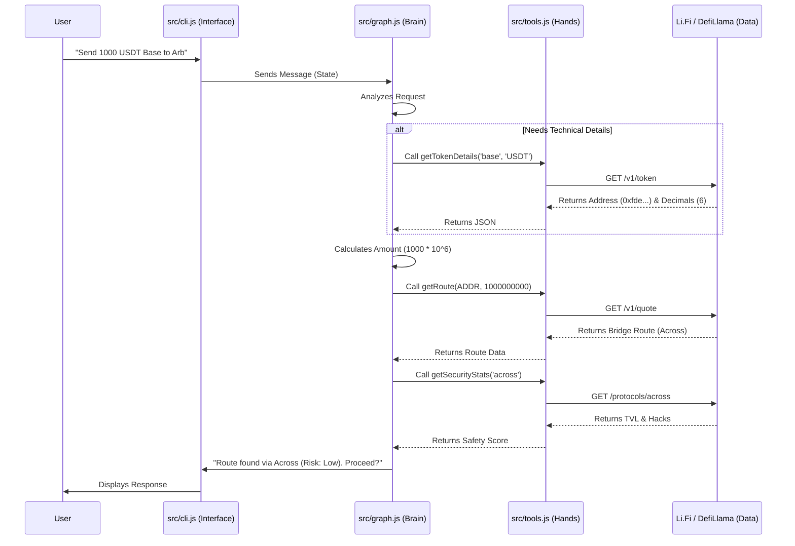

# Bridge Safety Agent - Comprehensive Technical Overview

This documentation provides a deep dive into the **Bridge Safety Agent**, an AI-powered CLI application that helps users safely navigate cross-chain transfers. It covers the architecture, control flow, code structure, and key technical decisions.

---

## 🏗️ System Architecture

The system is built on **Node.js** and leverages **LangGraph** (by LangChain) to orchestrate an Agentic workflow. It uses **Google Vertex AI** (Gemini) as the reasoning engine and **Li.Fi** as the data provider.

### High-Level Data Flow



### External API Integration

The system relies on the following **Li.Fi API Endpoints** (as defined in `src/tools.js`):

| Function | Method | Endpoint | Purpose |
| :--- | :--- | :--- | :--- |
| `getTokenDetails` | GET | `https://li.quest/v1/token` | Fetch technical details (Address, Decimals) for a specific token on a specific chain. Used for dynamic discovery. |
| `getRoute` | GET | `https://li.quest/v1/quote` | Fetch the best bridge route. Requires precise atomic amounts and addresses. |

*(Note: Security data uses DefiLlama APIs `https://api.llama.fi`)*

### LLM Integration (Vertex AI)

- **Model**: Google Gemini (via Vertex AI).
- **Role**: The LLM acts as the orchestrator. It does **not** hardcode logic. Instead:
    1. It **Decides** which tool to call based on the user's intent.
    2. It **Synthesizes** the results from tools into a human-readable answer.
    3. It **Follows Protocol**: The strict System Prompt ensures it always checks security before recommending a route.

---

## 📂 File-by-File Technical Guide

### 1. `src/cli.js` (The Interface)
**Purpose:** Manages the terminal user interface and session state.
*   **Dependencies:** `readline`, `src/graph.js`.
*   **Key Logic:**
    *   Creates a persistent `readline` interface.
    *   Maintains an in-memory `currentMessages` array.
    *   **Loop:**
        1.  Captures user input (`rl.question`).
        2.  Pushes input to `currentMessages`.
        3.  Invokes `graph.invoke({ messages: currentMessages })`.
        4.  Receives the *full* updated state.
        5.  Prints the last message (the Agent's response).

### 2. `src/graph.js` (The Brain)
**Purpose:** Defines the Agent's behavior, state machine, and tool access.
*   **Dependencies:** `@langchain/langgraph`, `@langchain/google-vertexai`.
*   **Key Components:**
    *   **StateGraph**: Defines a graph where nodes are "Agent" and "Tools".
    *   **System Prompt**: A carefully crafted instruction set that tells the LLM:
        *   To act as a "Bridge Safety Officer".
        *   **CRITICAL Workflow**: "If you don't know the address, call `get_token_details` first."
        *   **Safety Rule**: "Always check security stats before recommending."
    *   **ToolNode**: A pre-built LangGraph node that executes tools when the LLM requests them.

### 3. `src/tools.js` (The Hands)
**Purpose:** Contains the executable functions that interact with the outside world.
*   **Dependencies:** `axios` (for HTTP requests).
*   **Functions:**

    #### A. `getTokenDetails(chain, symbol)`
    *   **Goal**: Solve the "Address Resolution" problem.
    *   **Logic**: Calls Li.Fi's `/v1/token` endpoint.
    *   **Why**: The Bridge API fails if you guess the symbol. We need the exact Contract Address and Decimals (6 vs 18) to build a valid transaction.

    #### B. `getRoute(fromChain, toChain, fromToken, amount, toToken)`
    *   **Goal**: Find the technical bridge path.
    *   **Parameters**:
        *   `fromToken`: **Must be an Address** (0x...) for precision.
        *   `toToken`: **Symbol** (e.g. 'USDT') is preferred for destination to let the provider match the best canonical token.
        *   `amount`: **Atomic Units** (Integers). The Agent must calculate this using the decimals found in step A.

    #### C. `getSecurityStats(bridgeName)`
    *   **Goal**: Assess the safety of the protocol.
    *   **Logic**:
        *   Fetches TVL (Total Value Locked) from DefiLlama.
        *   Fetches Hack History.
        *   **Deterministic Scoring**:
            *   < $10M TVL = -20 points.
            *   Recent Hack = **Critical Failure** (Score 0).

    #### D. `getBridgeOptions(...)` (New)
    *   **Goal**: Compare multiple routes (Cost vs Safety).
    *   **Logic**:
        *   Calls `/v1/advanced/routes` (Aggregator Mode) to get Top 3 routes.
        *   Iterates through them and calls `getSecurityStats` for **each**.
        *   Returns a list of options: `[{ bridge: 'across', risk: 70 }, { bridge: 'stargate', risk: 90 }]`.
        *   Allows the Agent to say: "Option A is cheaper, but Option B is safer."

    #### E. `getSupportedBridges()` (New)
    *   **Goal**: Discovery.
    *   **Logic**: Returns the full list of supported protocols from `GET /v1/tools`.

---

## 🛠️ Key Technical Decisions

### Dynamic Token Discovery vs. Hardcoded Map
*   **Old Approach**: We had a `tokens.js` file with hardcoded addresses. This was brittle and limited to what we manually added.
*   **New Approach**: We exposed `getTokenDetails` as a tool. The Agent now "Googles" (uses the API) to find token details on the fly. This makes it support **any token on any chain** supported by Li.Fi.

### Atomic Amounts
*   Blockchains don't understand "10 USDC". They verify "10000000" (10 * 10^6).
*   The Agent is responsible for this math. It fetches `decimals: 6` from the API and performs the multiplication before calling the route tool.

### Agentic Workflow
*   We use **LangGraph** because it handles the "Loop".
*   If the Agent calls a tool, the graph loops back to the Agent with the result.
*   This allows multi-step reasoning: `Need Info` -> `Get Info` -> `Use Info` -> `Final Answer`.

---

## 🚀 Usage

1.  **Install**: `npm install`
2.  **Configure**: Ensure `.env` has your `GOOGLE_APPLICATION_CREDENTIALS`.
3.  **Run**: `npm start`
4.  **Interact**:
    ```text
    You: Send 500 USDC from Base to Optimism
    Agent: [Calls getTokenDetails...]
    Agent: [Calls getRoute...]
    Agent: [Calls getSecurityStats...]
    Agent: I found a route via Stargate. It has $450M TVL and is rated SECURE.
           You will receive 499.5 USDC. Proceed?
    ```
